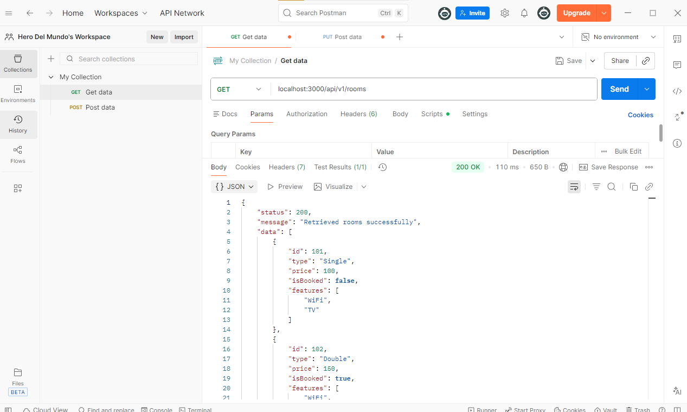

# RESTful API Activity - Hero Del Mundo

## Best Practices Implementation

### **1. Environment Variables:**

- **Why did we put `BASE_URI` in `.env` instead of hardcoding it?**  
- **Answer:**  
To make the configuration easy to change without editing the source code and to follow best practices by separating config from logic.

---

### **2. Resource Modeling:**

- **Why did we use plural nouns (e.g., `/rooms`) for our routes?**  
- **Answer:**  
Plural nouns represent a collection of resources and follow standard REST API conventions.

---

### **3. Status Codes:**

- **When do we use `201 Created` vs `200 OK`?**  
- **Answer:**  
`200 OK` for successful retrieval or update.  
`201 Created` when a new resource is successfully added.

- **Why is it important to return `404` instead of just an empty array or a generic error?**  
- **Answer:**  
It clearly tells the client that the requested resource does not exist.

---

### **4. Testing:**

- 
